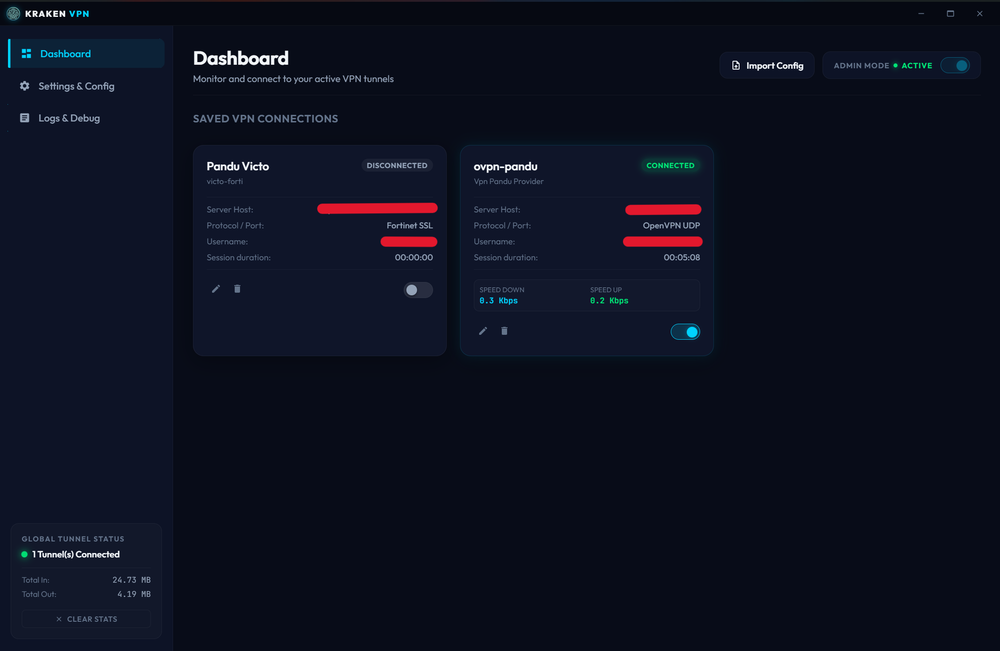
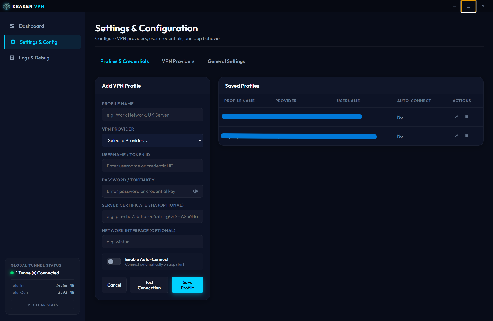
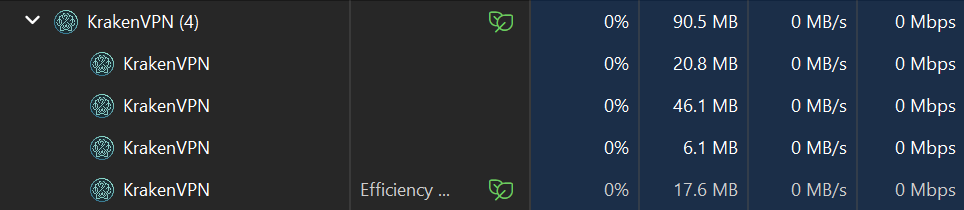

# 🦑 Kraken VPN Client

Kraken VPN is a sleek, modern, multi-profile desktop VPN client for Windows built with Electron. It supports **OpenVPN** and **OpenConnect (AnyConnect/Fortinet/GlobalProtect/Pulse)** protocols, providing real-time network traffic telemetry, logs console, and dynamic credentials profile management inside a custom premium dark-themed interface.

---

## 📸 Visual Preview & Product Narration

| **Sleek Connection Dashboard** | **Unified Settings & Configuration** |
|:---:|:---:|
|  |  |
| <p align="center">Monitor and connect to active VPN tunnels, track real-time upload/download speeds, and check global tunnel status.</p> | <p align="center">Configure user credentials, network interfaces, server certificates, custom endpoints, and general app preferences.</p> |

| **Light Weight VPN** |
|:---:|
|  |
| <p align="center">An light weight VPN client for any OpenVPN and OpenConnect protocols.</p> |

### 🦑 Why Kraken VPN?
Most corporate VPN clients are heavy, slow, or lack transparency. Kraken VPN was built as a lightweight, developer-first wrapper to bring order, speed, and premium aesthetics to VPN connections:
* **True Multi-Protocol Support**: Bring OpenVPN (`.ovpn`) profiles and OpenConnect endpoints together under one elegant window.
* **Telemetry at a Glance**: Real-time traffic rate tracking (scaling dynamically from `Kbps` to `Mbps`) helps monitor active downloads and connection health.
* **Instant Diagnostics**: The raw stdout/stderr streams of `openvpn` and `openconnect` are piped directly into an interactive dark-themed console, eliminating guess-work during connection issues.
* **Credential Profile Management**: Test and switch between profiles (e.g. Work VPN vs. Private Server) with one-click credential storage.

---

## ✨ Features

- **Multi-Protocol Support**: Seamless integration for OpenVPN (`.ovpn` profiles) and OpenConnect protocols.
- **Dynamic Telemetry & Bandwidth Speed Stats**: Real-time traffic rate tracking (scales dynamically from `Kbps` to `Mbps`) and combined aggregate counters.
- **Diagnostics Console**: Interactive terminal log stream viewer capturing raw OpenVPN and OpenConnect process outputs.
- **Theme Switching**: Custom light and dark themes tailored to premium guidelines.
- **Administrator Elevation Banner**: Built-in warning and request prompts to easily request administrator rights required for virtual interface routing.
- **System Tray Minimization**: Seamless window minimization to system tray and quit options.

---

## 📋 Prerequisites

Since Kraken VPN acts as a GUI wrapper orchestrating connection processes natively, the following command-line binaries must be installed on your Windows machine:

### 1. OpenVPN CLI
* **Download**: [OpenVPN Community Downloads](https://openvpn.net/community-downloads/) (ensure the OpenVPN Interactive Service and standard binaries are installed).
* **Default Directory path**: `C:\Program Files\OpenVPN\bin\openvpn.exe`.
* If installed in a custom location, you can update this path under the **Settings & Config -> General Settings** screen in the application.

### 2. OpenConnect CLI
* **Download**: [OpenConnect for Windows](http://www.infradead.org/openconnect/index.html) or via packaging utilities (e.g. `choco install openconnect`).
* **Default Directory path**: Add `openconnect.exe` to your Windows System `%PATH%`, or browse and specify the direct path inside the app **Settings & Config**.
* **Wintun Driver**: OpenConnect connections require the `wintun` interface driver. Ensure you have the `wintun.dll` driver active (included in standard OpenConnect packages).

---

## 🚀 Getting Started (Development)

To run Kraken VPN locally in development mode:

### 1. Clone the Repository
```powershell
git clone https://github.com/pandumalik/kraken-vpn.git
cd kraken-vpn
```

### 2. Install Dependencies
```powershell
npm install
```

### 3. Start the Application
Run the launch command (make sure to run your terminal as Administrator so that routing rules can be successfully registered):
```powershell
npm start
```

---

## 📦 Packaging & Distribution

Kraken VPN uses `electron-builder` to package the codebase into standalone binaries.

### Build Executables
Run the package script:
```powershell
npm run dist
```
Once completed, the output binaries will be created inside the **`dist/`** directory:
- **Installer**: `dist/KrakenVPN Setup 1.0.0.exe` (NSIS setup installer).
- **Portable**: `dist/KrakenVPN 1.0.0.exe` (Standalone portable execution).

> [!IMPORTANT]
> The packaged binaries are configured with `requestedExecutionLevel: "requireAdministrator"`. They will automatically trigger Windows User Account Control (UAC) prompts and always run as Administrator. Make sure to **Run as administrator** when launching the setup installer.

---

## 🛠️ Codebase Structure & Architecture

The application has been modularized by functionality to keep the codebase clean, readable, and easily maintainable:

```
kraken-vpn/
├── main.js                 # Electron Main Process (Bootstrapping, IPC channels)
├── preload.js              # Secure IPC Bridge API (contextBridge)
├── package.json            # Build scripts, configurations & dependencies
├── icon.png                # Client launcher & tray icon
├── dist/                   # Output folder for production builds
└── src/
    ├── index.html          # Core UI View (HTML5)
    ├── style.css           # Modern Custom Styling Sheet
    ├── main/               # Backend modules (running in Node.js context)
    │   ├── store.js        # File-based configurations storage (settings, profiles, logs)
    │   ├── utils.js        # Elevation check helpers
    │   └── vpn/
    │       ├── manager.js  # Process management, file cleanup, and state hooks
    │       ├── openconnect.js # OpenConnect connection spawning and telemetry stats query
    │       ├── openvpn.js  # OpenVPN connection spawning and management socket hook
    │       └── test.js     # Non-blocking VPN configuration test connection
    └── renderer/           # Frontend ES modules (running in Browser window context)
        ├── state.js        # Global client states, byte-scaling helpers
        ├── navigation.js   # Titlebar controls, panel routers
        ├── forms.js        # CRUD forms validation and tests triggers
        ├── ipc.js          # Electron event listeners (logs stream, telemetry update)
        ├── ui.js           # DOM renderer (dashboard lists, stats counters)
        └── toast.js        # Toast alerts feedback component
```

---

## ✍️ Modifying & Extending

If you want to modify or add features to Kraken VPN, follow these pointers:

### Adding New Connection Protocols
1. Implement your connection logic inside a new module in `src/main/vpn/`.
2. Spawning process: Return a status indicator, save connection processes under `activeConnections` in `src/main/vpn/manager.js` for process-tree cleanups.
3. Telemetry tracking: Send periodic reports via `mainWindow.webContents.send('vpn-telemetry-update', ...)` to display download/upload speed and duration.

### Editing Custom Styles
- Standard layouts, color tokens (harmonized sleek blues and dark variables), animations, and responsive breakpoints are declared at the top of [style.css](file:///d:/personal/code/kraken-vpn/src/style.css).

## 📄 License

This project is open-sourced under the **Kraken VPN Non-Commercial License** (refer to the [LICENSE](./LICENSE) file). You are free to modify and share the code, but selling or distributing the application or its derivatives for commercial gain is strictly prohibited unless authorized by the original author.
